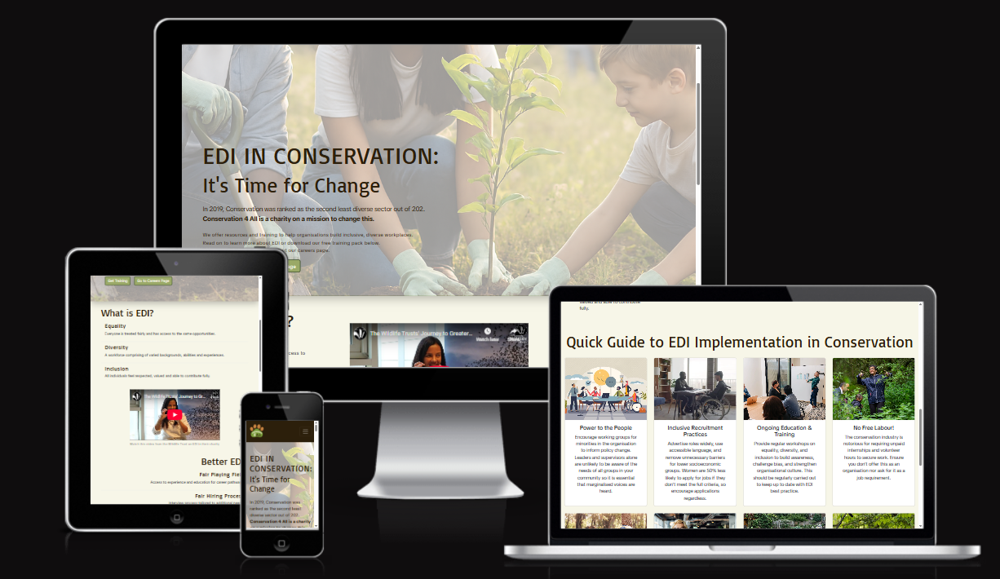
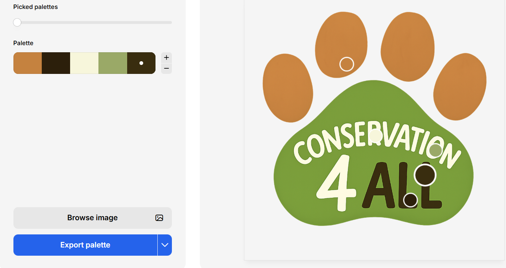

# Flagstone-EDI-in-conservation
 
##Project Brief 1 - Diversity and Inclusion Website - EDI in Conservation
### This website is built for a made-up charity 'Conservation4All', that aims to address the lack of diversity in the Conservation sector as a whole. The website's primary purpose is to offer guidance and training to environmental organisations and charities. This is achieved through concise explanations and a guide on EDI best practice, followed by a call to action to sign up to a full training programme, should they wish. As an extension, the charity also attempts to reset the imbalance by helping those who may be facing barriers beginning their career in conservation. To achieve this, the careers section offers inspirational advice from those in the field and lists paid opportunities in the sector. The website is fully responsive on all screen sizes and has clear navigation for a great user experience.

## Style Selection

### Fonts
[Londrina Solid and TikTok]https://fonts.google.com/share?selection.family=Londrina+Solid:wght@100;300;400;900|TikTok+Sans:opsz,wght@12..36,300..900

### Color Selection

