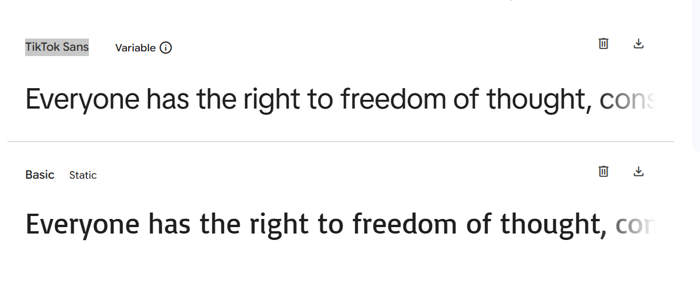
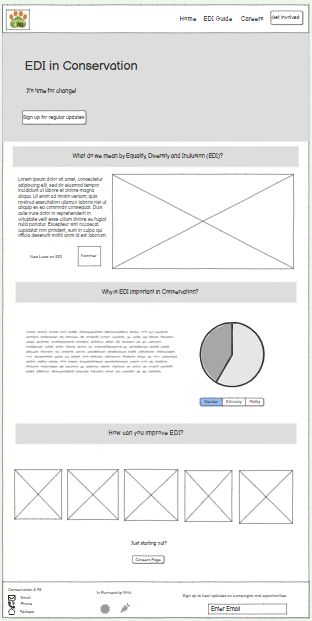
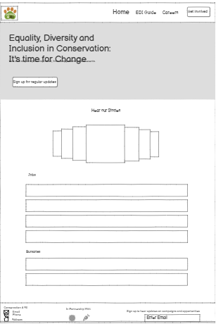
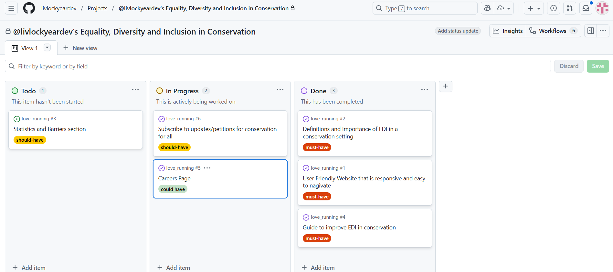
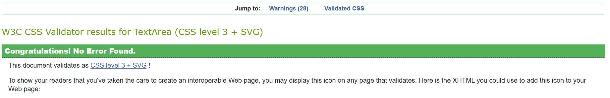
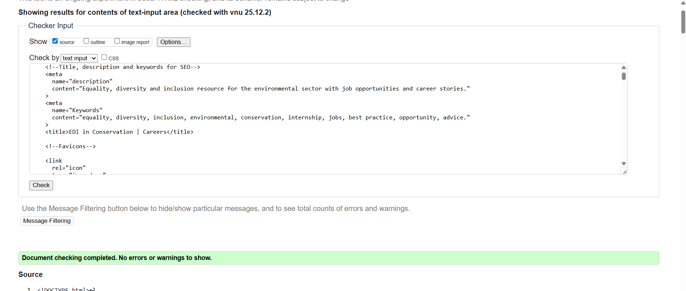
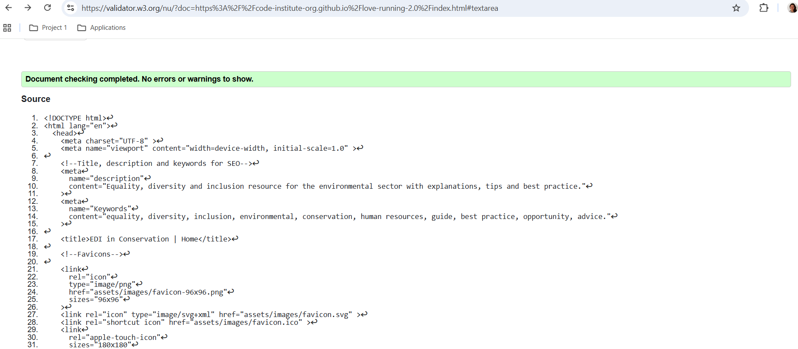
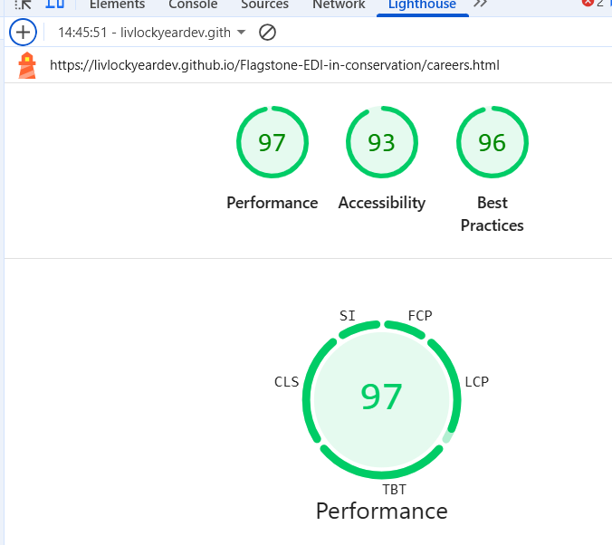
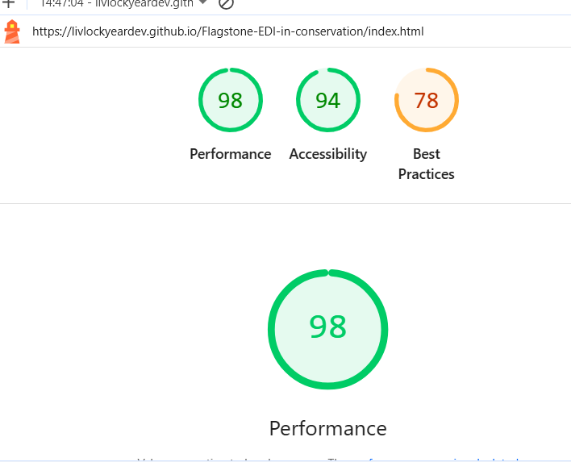

# Flagstone-EDI-in-conservation

[View Site Here](https://livlockyeardev.github.io/Flagstone-EDI-in-conservation/)

## Project Brief 1 - Diversity and Inclusion Website - EDI in Conservation

This website is built for a made-up charity 'Conservation4All', that aims to address the lack of diversity in the Conservation sector as a whole. The website's primary purpose is to offer guidance and training to environmental organisations and charities. This is achieved through concise explanations and a guide on EDI best practice, followed by a call to action to sign up to a full training programme, should they wish. As an extension, the charity also attempts to reset the imbalance by helping those who may be facing barriers beginning their career in conservation. To achieve this, the careers section offers inspirational advice from those in the field and lists paid opportunities in the sector. The website is fully responsive on all screen sizes and has clear navigation for a great user experience.

## Style Selection

The website should have a professional, clean look with uplifting, bold main fonts to show a powerful message. The colour scheme and logo reflects the nature based industry by including natural colours, greens and browns. 

### Fonts

### Color Selection

## Design and Project Management process

For this project, I first came up with 6 user stories:

1) As an environmental community group interested in improving diversity, I want a clear explanation of what is meant by EDI specifically in the context of the environmental sector and why it is important so I can understand the topic in question better.

2) User Story: As a first time visitor to the website, I want an easy, clear layout of website so that I know exactly what the site is advocating for and can find information and tips on Equality, Diversity and Inclusion in the UK quickly both on laptop and mobile.

3) User Story: As a new environmental charity, I want guidance on how I can improve EDI in the workplace so that I can make my organisation as inclusive as possible.

4) As a passionate conservationist I want to be able to follow the work that Conservation 4 All is doing so that I can support them in the future by signing petitions and donating.

5) As an entry level conservationist I want to read peoples career journeys and access current opportunities so that I can be inspired to take the leap into conservation as a career.

6) As a policymaker I want to be able to access statistics for EDI in conservation in the UK so that I can understand the main barriers for people entering the industry.

This led to the following wireframe designs:

This led to the following planning board with each story given a priority. 

I was able to complete 5/6 of the stories in the given time, leaving out statistics and changing the subscribe option to link to a sign up for a full training programme.

## Use of AI

I used AI for...
Content creation:
-Generate User Stories
-Supply facts and figures
-Generate hero image
-Generate EDI tips

Coding:
-Troubleshooting
-Explaining snippets of code/coaching
-Repetitive code generation 
-Changing multiple places in the code simultaneously

## Testing

CSS and HTML validation cleared. CSS warnings for use of vendor extensions.

Lighthouse Testing

Best practice score brought down by use of third party cookies within embedded video link.

